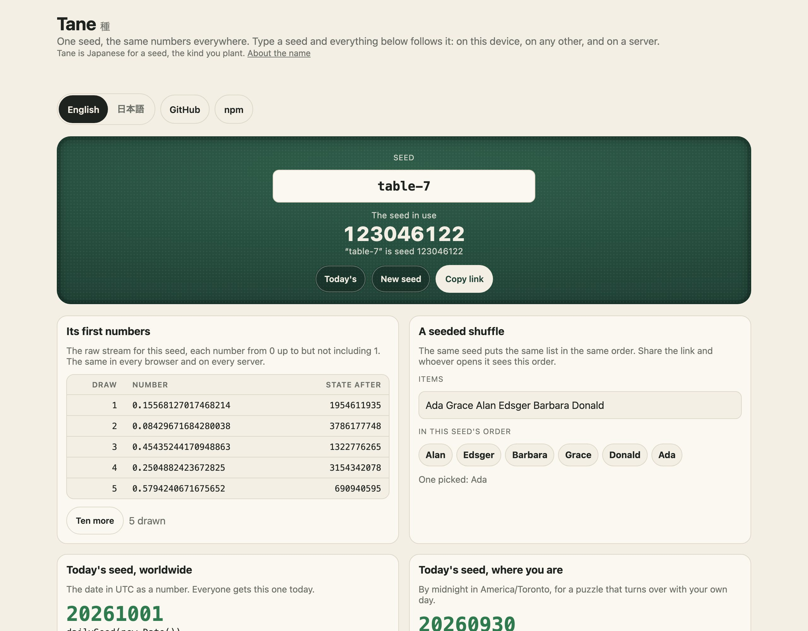
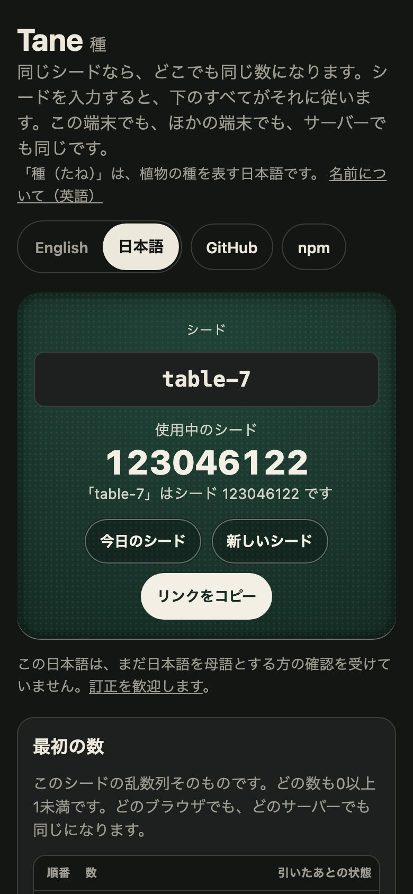

<h1 align="center">Tane <sub>種</sub></h1>

<p align="center"><strong>Seeded random numbers: one seed, the same numbers everywhere.</strong><br>
A seedable random number generator with the draws a game needs: shuffle, pick, sample, weighted choice, sub-streams, and a seed a day for daily puzzles. The same in every browser and on every server.</p>

<p align="center">
  <a href="https://github.com/johnmorrisdotca/tane/actions/workflows/ci.yml"></a>
  <a href="https://www.npmjs.com/package/@johnmorrisdotca/tane"></a>
  <a href="./LICENSE"></a>
  
  
</p>

<p align="center"><a href="https://johnmorrisdotca.github.io/tane/"><strong>Try a seed →</strong></a> · <a href="https://johnmorrisdotca.github.io/tane/api.html">API reference</a></p>

<p align="center">
  
  
</p>

A seeded pseudo-random number generator (PRNG) for JavaScript and TypeScript,
with the everyday draws built on it and a seed for every day.

- **What is different.** The numbers are specified, not just implemented:
  [the specification](./docs/spec.md) says what every function computes and
  gives test vectors, so a seed replays the same in any version and in any
  port. And it is more than a generator: daily seeds by time zone, seeds kept
  aside in blocks, sub-streams by name, and a stream's position saved as one
  line of text.
- **What it costs a project.** Nothing: no dependencies, and one import. A
  seeded shuffle is about 1 kB.

## In 30 seconds

```sh
npm install @johnmorrisdotca/tane    # or pnpm add, or yarn add
```

```ts
import { dailySeed, int, mulberry32, seedFrom, shuffled } from "@johnmorrisdotca/tane";

const random = mulberry32(seedFrom("table-7"));   // a stream: call it like Math.random
int(random, 1, 6);                                // 1: the same on every machine
shuffled(random, ["♠", "♥", "♦", "♣"]);           // ["♦", "♣", "♥", "♠"]

dailySeed(new Date());                            // 20260930 on 30 September 2026, worldwide
```

And from a terminal, on Linux, macOS or Windows:

```sh
npx @johnmorrisdotca/tane --seed table-7 --shuffle a b c   # the same order for that seed
```

Or with nothing to install, [try a seed in the explorer](https://johnmorrisdotca.github.io/tane/).

## Who it is for

- **Daily puzzles.** One puzzle for everybody today: `dailySeed(new Date())`
  is the date as a number, in UTC or by the midnight of any time zone.
- **Games.** A deal, a map or a bag of tiles that a link can replay, a
  computer player whose coin flips can be reproduced, and a saved game that
  is its seed and its moves.
- **Procedural generation.** Parts that never disturb each other:
  `deriveSeed(seed, "terrain")` and `deriveSeed(seed, "loot")` are separate
  streams from one seed.
- **Tests.** Random input that is the same on every run, and a failing case
  that is reported as one seed.
- **Teaching and simulation.** A classroom that all draws the same sample, and
  an experiment anybody can repeat.

**Not for secrets.** See [Not for secrets](#not-for-secrets).

## Use it in your project

Tane is plain functions over plain numbers. It has no interface of its own, so
every framework uses it the same way: make something from a seed, and show it.
The example below is the same small thing each time: a list in today's order,
the same for everybody who opens the page today.

### 1. The API alone

```ts
import { counted, deriveSeed, int, mulberry32, sample, shuffled, toText, weightedPick } from "@johnmorrisdotca/tane";

const seed = 42;
const deck = shuffled(mulberry32(deriveSeed(seed, "deck")), ["A", "K", "Q", "J"]);   // the deal
const dice = mulberry32(deriveSeed(seed, "dice"));                                    // a stream of its own
int(dice, 1, 6);                                                                      // 5

sample(mulberry32(seed), ["a", "b", "c", "d", "e"], 2);                // ["d", "c"]: two, none twice
weightedPick(mulberry32(seed), ["common", "rare", "epic"], [90, 9, 1]); // "common"

const random = counted(seed);            // a stream that knows where it is
shuffled(random, [1, 2, 3, 4, 5]);
toText(random.position());               // "tane:1:42:4": seed 42, four draws in
```

### 2. Plain HTML

```html
<ol id="order"></ol>
<script type="module">
  import { dailySeed, mulberry32, shuffled } from "./node_modules/@johnmorrisdotca/tane/dist/index.js";

  const order = shuffled(mulberry32(dailySeed(new Date())), ["Ada", "Grace", "Alan", "Edsger"]);
  document.getElementById("order").append(...order.map((name) => Object.assign(document.createElement("li"), { textContent: name })));
</script>
```

No bundler is needed: `dist/index.js` is an ES module that imports nothing
outside the package, so a `<script type="module">` reads it as it is, from
wherever you serve it.

### 3. React

```tsx
import { shuffled } from "@johnmorrisdotca/tane";
import { useDailySeed, useSeeded } from "@johnmorrisdotca/tane/react";

export function TodaysOrder({ names }: { names: string[] }) {
  const { day, seed } = useDailySeed();                       // moves to tomorrow at midnight on its own
  const order = useSeeded(seed, (random) => shuffled(random, names));
  return (
    <ol aria-label={day}>
      {order.map((name) => <li key={name}>{name}</li>)}
    </ol>
  );
}
```

`useDailySeed` re-renders once, at the next midnight in the zone. `useSeeded`
makes its value from a fresh stream whenever the seed changes, so the result
depends on the seed alone and never on how often the component rendered. In
Next.js, use them from a client component (`"use client"`).

### 4. Vue

```vue
<script setup>
import { computed } from "vue";
import { dailySeed, mulberry32, shuffled } from "@johnmorrisdotca/tane";

const props = defineProps({ names: Array });
const order = computed(() => shuffled(mulberry32(dailySeed(new Date())), props.names));
</script>

<template>
  <ol><li v-for="name in order" :key="name">{{ name }}</li></ol>
</template>
```

### 5. Svelte and Angular

```svelte
<script>
  import { dailySeed, mulberry32, shuffled } from "@johnmorrisdotca/tane";
  let { names } = $props();
  const order = $derived(shuffled(mulberry32(dailySeed(new Date())), names));
</script>

<ol>{#each order as name (name)}<li>{name}</li>{/each}</ol>
```

```ts
// Angular: a standalone component
import { Component, computed, input } from "@angular/core";
import { dailySeed, mulberry32, shuffled } from "@johnmorrisdotca/tane";

@Component({
  selector: "todays-order",
  template: `<ol>@for (name of order(); track name) {<li>{{ name }}</li>}</ol>`,
})
export class TodaysOrder {
  names = input.required<string[]>();
  order = computed(() => shuffled(mulberry32(dailySeed(new Date())), this.names()));
}
```

Each of the five is built from the packed tarball, opened in Chromium and
WebKit and checked against the order the seed must give, by
`scripts/check-frameworks.mjs`, before a release names it.

### What a developer gets

- **Typed results.** TypeScript types for everything, with a doc comment on
  every export.
- **A drop-in for `Math.random`.** A stream is `() => number` in [0, 1), so
  anything written against `Math.random` takes a seeded stream unchanged, and
  every draw here takes `Math.random` too.
- **Draw counts you can rely on.** Every function says how many numbers it
  takes from the stream, because a caller's next number depends on it.
- **No dependencies**, ES modules, a `default` export condition for tools that
  resolve from CommonJS, and `sideEffects: false`, so a bundler drops what you
  do not import.
- **Sizes.** A stream, a shuffle, a whole number and today's seed are about
  1.3 kB minified (0.7 kB gzipped) once a bundler has shaken the rest out.
  Everything, with the command line's words in two languages, is about 28 kB
  (10 kB gzipped).
- **Where it runs.** Every current browser, Node 22 or later, Deno and Bun.

## Architecture

The generator, the draws and the seed handling are plain functions with no
DOM and no dependencies, so every number is the same on every device. The
command line is one pure function too, and the React hooks are the only part
that needs a framework.

```text
src/
├── index.ts    the main entry: everything below, and the command line's function, in one import
├── random.ts   the seeded generator (mulberry32), and the ways to start and split one
├── draws.ts    what a game draws from a stream: whole numbers, picks, shuffles, samples
├── seeds.ts    seeds as plain numbers people pass around, and the blocks kept aside for daily and weekly seeds
├── daily.ts    one seed a day, the same for everybody, in any time zone
├── save.ts     a stream's position written down and read back, as text, JSON or CSV
├── strings.ts  every word Tane says to a person, in English and Japanese
├── cli.ts      the command line as a pure function: arguments in, text and an exit code out
├── react.ts    the "/react" entry: hooks for today's seed and for a seeded stream
└── version.ts  the version of this package, as package.json has it
```

Tests sit beside the code they test (`*.test.ts`), and `src/docs.test.js` runs
the README's examples. `bin/` is the few lines that hand the command line the
real process, `scripts/` builds the demo and checks the package as npm packs
it, and `demo/` is the page published on GitHub Pages.

## The name

*Tane* (種, たね) is the Japanese word for a seed, the kind you plant. Say it
in two even beats: ta-ne, "tah-neh".

The same word is used for the secret behind a conjuring trick: *tane-akashi*
(種明かし) is showing how the trick was done. That suits a package whose
randomness has nothing up its sleeve: give it the seed and anybody can see
exactly how the cards came to fall as they did.

## Where it comes from, and where it is used

Tane was built for [Itsutsu](https://itsutsu.com), a site for board games,
puzzles, card games and dice games played at your own pace. *Itsutsu* (五つ) is
Japanese for "five", after five in a row, the game the site began with. Every
deal, every daily puzzle and every computer player's coin flip there comes
from these functions, exactly as published here.

### Used by

- [Itsutsu](https://itsutsu.com), for its daily puzzles, its deals and its
  computer players.

That is the whole list so far. Using Tane in something? Open an
[*Add my project*](https://github.com/johnmorrisdotca/tane/issues/new?template=add-my-project.md)
issue and we will add you.

### The family

<!-- family:start (made by scripts/family-readme.mjs from scripts/family-template.mjs; change those, not this) -->
Tane is one of twenty-four packages, each made for the same site, each at
[github.com/johnmorrisdotca](https://github.com/johnmorrisdotca). The code of every one is MIT.

- [Korokoro](https://github.com/johnmorrisdotca/korokoro) (コロコロ): dice, with notation, exact odds, real sounds and the dice of many games. [Demo](https://johnmorrisdotca.github.io/korokoro/).
- [Kyuubu](https://github.com/johnmorrisdotca/kyuubu) (キューブ): a turning cube for the browser, 2×2 to 7×7, with record solves to replay. [Demo](https://johnmorrisdotca.github.io/kyuubu/).
- [Hitotsu](https://github.com/johnmorrisdotca/hitotsu) (一つ): a colour-card shedding game for two to eight, with the house rules people play. [Demo](https://johnmorrisdotca.github.io/hitotsu/).
- [Toranpu](https://github.com/johnmorrisdotca/toranpu) (トランプ): a deck of playing cards, card games with computer players, and solitaires. [Demo](https://johnmorrisdotca.github.io/toranpu/).
- [Tane](https://github.com/johnmorrisdotca/tane) (種): seeded random numbers and daily seeds, the same in every browser and on every server. [Demo](https://johnmorrisdotca.github.io/tane/).
- [Narabe](https://github.com/johnmorrisdotca/narabe) (並べ): one rules engine for abstract board games, from gomoku and Reversi to Go and checkers. [Demo](https://johnmorrisdotca.github.io/narabe/).
- [Tenka](https://github.com/johnmorrisdotca/tenka) (天下): world conquest for two to six, on a map of the real world. [Demo](https://johnmorrisdotca.github.io/tenka/).
- [Kumimoji](https://github.com/johnmorrisdotca/kumimoji) (組み文字): a crossword tile race, in English and Japanese kana. [Demo](https://johnmorrisdotca.github.io/kumimoji/).
- [Tsunagi](https://github.com/johnmorrisdotca/tsunagi) (繋ぎ): a line-joining logic puzzle whose every level has exactly one answer. [Demo](https://johnmorrisdotca.github.io/tsunagi/).
- [Jarajara](https://github.com/johnmorrisdotca/jarajara) (ジャラジャラ): mahjong tiles drawn as SVG, stacked layouts, and the matching solitaire Awase. [Demo](https://johnmorrisdotca.github.io/jarajara/).
- [Suido](https://github.com/johnmorrisdotca/suido) (水道): a pipe puzzle: turn the pieces until the water reaches every drain. [Demo](https://johnmorrisdotca.github.io/suido/).
- [Domino](https://github.com/johnmorrisdotca/domino) (ドミノ): dominoes and Mexican Train. [Demo](https://johnmorrisdotca.github.io/domino/).
- [Kotoba](https://github.com/johnmorrisdotca/kotoba) (言葉): word lists and word-game rules in English, French, German and Japanese. [Demo](https://johnmorrisdotca.github.io/kotoba/).
- [Sugoroku](https://github.com/johnmorrisdotca/sugoroku) (双六): backgammon and its variants, with the doubling cube and match play. [Demo](https://johnmorrisdotca.github.io/sugoroku/).
- [Kazu](https://github.com/johnmorrisdotca/kazu) (数): grid number puzzles: Sudoku and its variants, Futoshiki and Skyscrapers. [Demo](https://johnmorrisdotca.github.io/kazu/).
- [Meikyuu](https://github.com/johnmorrisdotca/meikyuu) (迷宮): mazes on squares, hexagons, triangles and circles, made from a seed and drawn through with a finger or the mouse. [Demo](https://johnmorrisdotca.github.io/meikyuu/).
- [Hikidashi](https://github.com/johnmorrisdotca/hikidashi) (引き出し): a drawer of small Japanese text tools: era dates, kanji numerals, readings and sentence difficulty. [Demo](https://johnmorrisdotca.github.io/hikidashi/).
- [Chizu](https://github.com/johnmorrisdotca/chizu) (地図): maps of the world and of countries' regions, in English and Japanese, with a quiz and callouts. [Demo](https://johnmorrisdotca.github.io/chizu/).
- [Bushu](https://github.com/johnmorrisdotca/bushu) (部首): find a kanji by the parts it is made of. [Demo](https://johnmorrisdotca.github.io/bushu/).
- [Tobiishi](https://github.com/johnmorrisdotca/tobiishi) (飛び石): peg solitaire with nine boards and seeded solvable challenges. [Demo](https://johnmorrisdotca.github.io/tobiishi/).
- [Jirai](https://github.com/johnmorrisdotca/jirai) (地雷): minesweeper on shaped grids with verified no-guess boards. [Demo](https://johnmorrisdotca.github.io/jirai/).
- [Gunjin](https://github.com/johnmorrisdotca/gunjin) (軍人): five hidden-rank strategy games with pass-the-device play. [Demo](https://johnmorrisdotca.github.io/gunjin/).
- [Karakuri](https://github.com/johnmorrisdotca/karakuri) (からくり): eight hyper-casual puzzle games, some of them physics: draw a shield, pull pins, cut ropes, slide blocks, pour tubes. [Demo](https://johnmorrisdotca.github.io/karakuri/).
- [Houseki](https://github.com/johnmorrisdotca/houseki) (宝石): gem and stone matching puzzles: falling triplets, stone collapse, colour chains and gem swap. [Demo](https://johnmorrisdotca.github.io/houseki/).

**This package is Tane.** The demos of all twenty-four share one header and footer, so each links the rest.
<!-- family:end -->

## Features

- **Bit-for-bit reproducible.** mulberry32 over 32-bit whole-number
  arithmetic, so the same seed gives the same numbers in every engine. Golden
  values are pinned in the tests and never move between versions.
- **Specified.** [docs/spec.md](./docs/spec.md) defines every function in
  words and gives test vectors, also as
  [JSON](./docs/spec-vectors.json), and the tests run a second implementation
  written from those words against the package.
- **The draws you need.** Whole numbers, floats, coin flips, pick, shuffle (in
  place or a copy), sampling without replacement, weighted choice and a normal
  distribution.
- **Seeds from anything.** `seedFrom("table-7")` turns whatever a person typed
  into a seed; `hashSeed` is the hash under it.
- **Sub-streams.** `deriveSeed(seed, "deck")` and `deriveSeed(seed, "dice")`
  are unrelated streams from one seed, so adding a third part later never
  shifts the first two. `fork` splits a stream off another.
- **A position you can keep.** A stream's whole state is its seed and how many
  numbers have been drawn. `counted` keeps the count, `randomAt` picks a stream
  up at any draw in one step, and the position is written as text, JSON or CSV.
- **Seeds that travel.** Seeds are whole numbers from 1 to 2³¹ − 1, safe in an
  address or JSON. Keep ranges aside as *seed blocks* (the daily puzzles, a
  weekly event) and draw fresh seeds that never land in one.
- **One seed a day.** `dailySeed(date)` is the date as a number: 2026-09-30 is
  20260930. UTC by default, or the midnight of any IANA time zone, with
  calendar arithmetic that daylight saving cannot fool.
- **A command line.** `tane --seed 42 --shuffle a b c`, `tane --today`, with
  JSON and CSV. See [The command line](#the-command-line).
- **English and Japanese**, for the command line and the explorer.

## Streams

```ts
import { fork, hashSeed, mulberry32, seedFrom, step } from "@johnmorrisdotca/tane";

const random = mulberry32(42);
random();                     // 0.6011037519201636
random();                     // 0.44829055899754167

hashSeed("room-7");           // 948657874: any text as a seed
seedFrom("42");               // 42: digits are the number itself
seedFrom("table");            // 115308040: anything else is hashed

const first = step(42);       // one draw as a pure function
first.value;                  // 0.6011037519201636, the same as mulberry32(42)()
first.state;                  // 1831565855: keep it, and step(first.state) is the next draw

const side = fork(random);    // a stream of its own, for one draw from `random`
```

`mulberry32(seed)` reads the seed as an unsigned 32-bit integer, so any whole
number works, and 2³² + 1 is the same seed as 1. `seededRandom` is the same
function under a plainer name.

## Draws

Every draw takes the stream first, so it runs on `Math.random` too.

| Function | Returns | Draws |
| --- | --- | --- |
| `below(random, n)` | a whole number from 0 up to, not including, `n` | 1 |
| `int(random, min, max)` | a whole number from `min` to `max`, both included | 1 |
| `float(random, min, max)` | a number from `min` up to, not including, `max` | 1 |
| `chance(random, p)` | `true` with probability `p` | 1 |
| `pick(random, items)` | one item | 1 |
| `shuffle(random, array)` | the same array, shuffled in place (Fisher–Yates) | length − 1 |
| `shuffled(random, items)` | a shuffled copy | length − 1 |
| `sample(random, items, count)` | `count` different items, in the order drawn | `count` |
| `distinctBelow(random, count, limit)` | `count` different whole numbers below `limit`, drawing again on a repeat | varies |
| `weightedIndex(random, weights)` | an index chosen in proportion to its weight | 1, or 0 when the weights sum to nothing |
| `weightedPick(random, items, weights)` | the item at that index | the same |
| `normal(random, mean = 0, spread = 1)` | a normally distributed number (Box–Muller) | 2 |

`below`, `int`, `pick` and `weightedPick` throw a `RangeError` for a range or
a list with nothing in it, rather than returning `NaN` or `undefined`.

```ts
import { below, chance, float, mulberry32 } from "@johnmorrisdotca/tane";

below(mulberry32(42), 10);      // 6
float(mulberry32(42), 0, 10);   // 6.011037519201636
chance(mulberry32(42), 0.5);    // false: the draw was 0.601…
```

## Parts that never disturb each other

```ts
import { deriveSeed } from "@johnmorrisdotca/tane";

deriveSeed(42, "deck");        // 3104557420
deriveSeed(42, "dice");        // 217474656
deriveSeed(42, "round", 3);    // round 3's seed: labels are read in order
```

Give each part of a game its own stream and the deck stays the deck however
many dice are rolled. A label may be text or a whole number; the number 3 and
the text "3" are different parts.

## Seeds that travel

```ts
import { checkBlocks, drawSeed, freshSeed, inBlock, isSeed, mulberry32, SEED_MOST } from "@johnmorrisdotca/tane";

SEED_MOST;                          // 2147483647: the largest seed, 2³¹ − 1
isSeed(Number("20260930"));         // true: a whole number from 1 to SEED_MOST
isSeed(Number("abc"));              // false

const DAILY = { from: 1_000_000_000, size: 100_000_000 };
freshSeed({ reserved: [DAILY] });   // a new seed, never one a day is played at
drawSeed(mulberry32(42));           // 1290860478: the same, from a stream of your own
inBlock(1_020_261_003, DAILY);      // true
checkBlocks([DAILY]);               // the blocks sorted; throws if two overlap
```

`drawSeed` spreads one draw over the seeds that are left and steps it over
each reserved block, so every free seed is equally likely and no draw is
wasted.

| Option of `drawSeed` and `freshSeed` | Means | Unless said |
| --- | --- | --- |
| `most` | the largest seed to draw | `SEED_MOST` |
| `reserved` | blocks a drawn seed never lands in; they must not overlap | none |

## A seed a day

```ts
import { addDays, dailySeed, dayKey, dayOfSeed, daySeed, daysBetween, isDayKey, nextDayStart } from "@johnmorrisdotca/tane";

const at = new Date("2026-10-01T03:30:00Z");
dayKey(at);                                  // "2026-10-01"
dailySeed(at);                               // 20261001
dailySeed(at, "America/Toronto");            // 20260930: still the evening before there
nextDayStart(at, "America/Toronto");         // 2026-10-01T04:00:00.000Z: when that seed changes

isDayKey("2026-02-30");                      // false: not a real date
addDays("2026-02-27", 3);                    // "2026-03-02"
daysBetween("2026-01-01", "2026-12-31");     // 364

const DAILY = { from: 1_000_000_000, size: 100_000_000 };
daySeed("2026-10-03", DAILY);                // 1020261003: a day's seed inside a block kept for it
dayOfSeed(1_020_261_003, DAILY);             // "2026-10-03", or null for a seed that names no day
```

A day is `YYYY-MM-DD`. The day is UTC unless a zone is named, which is what
makes a daily puzzle one puzzle worldwide; name an IANA zone for one that
turns at a place's own midnight. Days are counted on the calendar, never by
adding 24 hours to a local time, so a day that gains or loses an hour to
daylight saving is still one day.

## Export and import

A stream's position is its seed and how many numbers have been drawn from it.
That is all there is to keep, and it is written three ways.

```ts
import { counted, fromJSON, fromText, randomAt, shuffled, toCSV, toJSON, toText } from "@johnmorrisdotca/tane";

const random = counted(42);
shuffled(random, [1, 2, 3, 4, 5]);           // four draws
const kept = random.position();              // { seed: 42, draws: 4 }

toText(kept);                                // "tane:1:42:4": one line to paste
fromText("tane:1:42:4");                     // { seed: 42, draws: 4 }

toJSON(kept);                                // the JSON below
fromJSON(toJSON(kept));                      // { seed: 42, draws: 4 }

randomAt(kept.seed, kept.draws)();           // 0.17481389874592423: the fifth number, in one step
toCSV({ seed: 42, draws: 0 }, 2);            // the CSV below
```

```json
{
  "format": 1,
  "generator": "tane 1.2.1",
  "algorithm": "mulberry32",
  "seed": 42,
  "draws": 4,
  "state": 3031295998
}
```

```csv
draw,value,state
1,0.6011037519201636,1831565855
2,0.44829055899754167,3663131668
```

| Field of the JSON | Holds |
| --- | --- |
| `format` | 1. It goes up only when a reader of the old shape would be wrong about the new one |
| `generator` | what wrote it, for people |
| `algorithm` | `"mulberry32"` |
| `seed` | the seed, as an unsigned 32-bit integer |
| `draws` | how many numbers have been drawn |
| `state` | the generator's state at that position, as a check |

**Nothing read is trusted.** `fromJSON` and `fromText` give back a position or
`null`: the seed and the draws must be whole numbers in range, the state must
be the one they come to, and a later format is refused rather than guessed at.
The CSV ends its lines CRLF, as RFC 4180 has it, and is for a spreadsheet; it
is not read back.

## The command line

```sh
npm install -g @johnmorrisdotca/tane    # then `tane`, or use npx with nothing installed
```

```
Usage: tane [options]

Seeded random numbers: one seed, the same numbers on every machine.

  tane --seed table --count 10       the first ten numbers of a seed
  tane --seed 42 --int 1..6 -n 5     five whole numbers from 1 to 6
  tane --seed 42 --shuffle a b c     the same order for the same seed
  tane --seed 42 --pick a b c        one of them
  tane --seed 42 --sample 2 a b c    two of them, none twice
  tane --seed 42 --derive deck       the seed of a part named "deck"
  tane --today                       today's seed, the same worldwide
  tane --today --zone Asia/Tokyo     today's seed by one place's midnight
  tane --today --shuffle a b c       today's order, the same for everybody

Options:
  -s, --seed <seed>     a whole number, or any text (hashed to a number)
  -n, --count <n>       how many numbers (1 to 10000; 5 unless said)
      --skip <n>        start after n draws
      --int <min..max>  whole numbers from min to max, both included
      --shuffle         the items in a seeded order
      --pick            one of the items (with --count, that many picks)
      --sample <n>      n of the items, none twice
      --derive <label>  the seed of a labelled part (may be given twice)
      --today           today's seed and the day; with a job, the seed it uses
      --zone <zone>     an IANA time zone for --today (UTC unless said)
      --at <position>   carry on from a position: tane:1:42:7
      --stdin           read items from standard input, one to a line
  -j, --json            print JSON (format 1)
      --csv             print CSV
      --lang <en|ja>    English or Japanese (default: your system's)
      --no-color        no colour (NO_COLOR is honoured too)
  -h, --help            this help
  -v, --version         the version

Items are the other arguments, separated by spaces or commas. With no seed,
one is drawn and named on standard error, so that the run can be repeated.
With nothing asked for, prints today's seed. Not for secrets: the numbers can
be predicted. Exit codes: 0 done, 1 what was asked for could not be done,
2 the command was wrong.
```

```sh
$ tane --seed 42 --shuffle a b c
c
a
b
$ tane --seed 42 --int 1..6 -n 5 --json
{
  "format": 1,
  "generator": "tane 1.2.1",
  "seed": 42,
  "skipped": 0,
  "min": 1,
  "max": 6,
  "integers": [4, 3, 6, 5, 2],
  "position": "tane:1:42:5"
}
$ ls | tane --today --shuffle --stdin      # today's order of the files here
```

(The JSON is printed two spaces deep, one value to a line; the list is on one
line here to save room.) The language follows `--lang`, then `LC_ALL`,
`LC_MESSAGES` and `LANG`, then the system's. Output is plain when piped. It is
run as a child process on Linux, macOS and Windows in CI.

From code, the whole command line is one pure function:

```ts
import { runCli } from "@johnmorrisdotca/tane";

runCli(["--seed", "42", "--pick", "a", "b", "c"]);   // { code: 0, out: "b\n", err: "" }
```

## API

The [API reference](https://johnmorrisdotca.github.io/tane/api.html) lists every export of every entry point with its signature and its doc comment. It is made from the source by `pnpm site`, so it cannot fall behind the code.

Every export, by module. All of it comes from `@johnmorrisdotca/tane`, except
the two hooks.

### Streams

| Export | What it is |
| --- | --- |
| `type Random` | `() => number`: a number in [0, 1), like `Math.random` |
| `type Step` | `{ value, state }`: one draw and the state after it |
| `mulberry32(seed)` | a seeded stream |
| `seededRandom(seed)` | the same function, under a plainer name |
| `step(state)` | one draw as a pure function: `{ value, state }` |
| `hashSeed(text)` | an unsigned 32-bit seed from any text |
| `deriveSeed(seed, ...labels)` | the seed of a labelled part |
| `fork(random)` | a new stream split off another, for one draw |

### Draws

`below`, `int`, `float`, `chance`, `pick`, `shuffle`, `shuffled`, `sample`,
`distinctBelow`, `weightedIndex`, `weightedPick`, `normal`: see
[Draws](#draws).

### Seeds

| Export | What it is |
| --- | --- |
| `SEED_MOST` | 2147483647, the largest seed that travels |
| `type SeedBlock` | `{ from, size }`: seeds from `from` up to, not including, `from + size` |
| `type DrawSeedOptions` | `{ most?, reserved? }` |
| `isSeed(value, most?)` | whether a value read from outside is a whole number from 1 to `most` |
| `seedFrom(input)` | a seed from a number, its digits, or any text |
| `inBlock(seed, block)` | whether a seed falls inside a block |
| `checkBlocks(blocks, most?)` | the blocks sorted and checked; throws on a fault |
| `drawSeed(random, options?)` | a seed drawn from a stream, skipping reserved blocks: one draw |
| `freshSeed(options?)` | the same, from `Math.random` |

### Days

| Export | What it is |
| --- | --- |
| `type DayKey` | a date written `YYYY-MM-DD` |
| `dayKey(at, timeZone?)` | the day a moment falls on |
| `dailySeed(at, timeZone?)` | that day as a number |
| `isDayKey(text)` | whether a text is a real date written that way |
| `addDays(day, by)` | the day so many days on, or back |
| `daysBetween(from, to)` | how many days `to` is after `from` |
| `nextDayStart(at, timeZone?)` | the moment the day next turns |
| `daySeed(day, block)` | a day's seed inside a block kept for it |
| `dayOfSeed(seed, block)` | the day such a seed names, or `null` |

### Keeping a stream

| Export | What it is |
| --- | --- |
| `SAVE_FORMAT` | 1 |
| `type StreamPosition` | `{ seed, draws }` |
| `type SavedStream` | the object `toJSON` writes |
| `type CountedRandom` | a `Random` with `seed`, `draws` and `position()` |
| `counted(seed, draws?)` | a stream that counts its draws |
| `randomAt(seed, draws?)` | a stream that starts so many draws in |
| `stateAt(seed, draws?)` | the generator's state at that position |
| `savedStream(position)` | the position as the object `toJSON` writes |
| `toJSON(position)`, `fromJSON(text)` | JSON, and back, or `null` |
| `toText(position)`, `fromText(text)` | one line of text, and back, or `null` |
| `toCSV(position, count)` | the next `count` draws as CSV |
| `CSV_COLUMNS`, `MAX_CSV_ROWS` | the CSV's columns, and the most rows at once |

### Words and the command line

| Export | What it is |
| --- | --- |
| `STRINGS` | every string in English and Japanese: `STRINGS.ja.pageSeed` |
| `type TaneStrings`, `type Language` | the table's shape; `"en"` or `"ja"` |
| `fillIn(template, values)` | fills a string's `{braces}` |
| `languageOf(tag)` | `"ja"` for a tag that starts `ja`, `"en"` otherwise |
| `runCli(args, surroundings?)` | the command line as a pure function |
| `cliLanguage(flag, env, locale?)` | the language the command line would speak |
| `type CliSurroundings`, `type CliResult` | what it is run in, and what it comes to |
| `CLI_MAX_COUNT` | 10000 |
| `VERSION` | this package's version |

### React (`@johnmorrisdotca/tane/react`)

| Export | What it is |
| --- | --- |
| `useDailySeed(timeZone?)` | `{ day, seed }` for today, changing at midnight on its own |
| `useSeeded(seed, make)` | what `make(random)` made from a fresh stream, made again only when the seed changes |
| `type DailySeed` | `{ day, seed }` |

## Theming

Tane draws nothing: it has no component and no stylesheet, so there is nothing
of its own to theme, and what you build with its numbers looks however your
page looks.

The demo page is themed, and is the worked example. It wears the family's
one stylesheet, [`demo/family.css`](./demo/family.css), which is the same file
byte for byte on every sibling's site (a test holds it to its hash), and a
small one of its own, [`demo/tane.css`](./demo/tane.css). Every colour and
size in both is a CSS custom property on `:root`, in light and in dark:

| Property | What it colours or sizes | Light | Dark |
| --- | --- | --- | --- |
| `--page` | the page behind everything | `#f4efe4` | `#141614` |
| `--ink` | text, and a pressed button | `#1f2320` | `#ece8dc` |
| `--muted` | notes and labels | `#6b6f68` | `#a09d93` |
| `--rule` | borders and rules | `#ddd6c6` | `#3a3d38` |
| `--surface` | panels, fields and buttons | `#fbf8f1` | `#1d201e` |
| `--felt`, `--felt-deep` | the green the seed sits on | `#2f5d4a`, `#1f4135` | `#214337`, `#152c24` |
| `--felt-ink` | text on the felt | `#f3efe4` | the same |
| `--accent`, `--accent-ink` | the selected tab, the focus ring | `#b5452c`, `#fff` | the same |
| `--good`, `--bad` | today's seed; a refusal | `#2f7a4f`, `#b5452c` | the same |
| `--gold`, `--gold-ink` | a badge | `#e0b43b`, `#1f2320` | the same |
| `--radius` | the corners of panels | `16px` | |
| `--font`, `--mono` | the type: the system's own, and its monospace | | |
| `--intro-room`, `--intro-room-wide` | room kept for the header's words, so that changing language moves nothing | `11rem`, `7.25rem` | |

The page follows the device's light or dark setting; `data-theme="light"` or
`"dark"` on `<html>` forces one. To give a copy of the explorer another look,
set the properties after the two stylesheets:

```css
:root { --felt: #23405a; --felt-deep: #162a3c; --accent: #d4a017; --radius: 8px; }
```

## Limits

All of these are exported constants or stated in the doc comments, and each
is refused by name.

| Limit | Value | Constant |
| --- | --- | --- |
| A generator's seed | any whole number, read modulo 2³² | |
| A seed that travels | 1 to 2,147,483,647 | `SEED_MOST` |
| The stream's period | 4,294,967,296 draws, then it repeats | |
| Text `seedFrom` reads as a number | 1 to 10 digits, up to 4,294,967,295 | |
| Rows of CSV at once | 100,000 | `MAX_CSV_ROWS` |
| Numbers from one run of the command line | 10,000 | `CLI_MAX_COUNT` |
| Draws in a position | up to 2⁵³ − 1 | |
| Days | the years 0000 to 9999, on the Gregorian calendar | |

## Not for secrets

mulberry32 is a fast statistical generator, not a cryptographic one: its whole
state is 32 bits and can be recovered from a few outputs. Use
`crypto.getRandomValues` for passwords, tokens, invite codes, or a game where a
player could profit from predicting the next card.

Its 2³² seeds are also all the streams there are. That is plenty for a daily
puzzle or a deal, and too few to draw from at random for, say, every possible
order of a 52-card deck: a seeded shuffle reaches at most 2³² of them.

## Accessibility

Tane draws nothing and plays no sound, so the package has nothing to see, hear
or focus: what you build with its numbers is as accessible as you make it.
Its command line prints plain text, in English or Japanese.

The demo page, the explorer, is the worked example. Each of its sections is a
labelled region, the seed and the numbers it comes to are in a polite live
region, so a screen reader hears them change, the three ways of writing a
position down are a tab list that says which is selected, a paste field says
when what was pasted cannot be read, and a refusal is a status message.
`src/docs.test.js` checks these against the page's source.

## Browser and runtime support

Every current browser, Node 22 or later, Deno and Bun. It needs ES2020 and
`Math.imul`. Time zones other than UTC use `Intl.DateTimeFormat`, which every
one of those has. The demo is tested in Chromium and in WebKit, Safari's
engine, at phone size with touch.

## Languages

English and Japanese, for the command line (`--lang`, or the system's) and
the explorer, which has a chooser of its own, follows the browser's language
on a first visit, and takes `?lang=ja` or `?lang=en` in the address.
**Japanese: included; not yet reviewed by a native reader. Corrections
welcome.** Every Japanese string is listed beside its English in
[docs/strings-ja.md](./docs/strings-ja.md), and there is an
[issue template](https://github.com/johnmorrisdotca/tane/issues/new?template=fix-a-translation.md)
for fixing one.

## Roadmap

- Generators with more state (sfc32, xoshiro128**) behind the same `Random`
  type, for simulations that draw billions of numbers. They would be new
  functions; `mulberry32` stays as it is.
- Weighted sampling from a table built once (the alias method), for heavy use.
- Weekly and monthly seeds beside the daily one.
- The vectors run against the family's other copies in their own CI.

Left out on purpose: cryptographic randomness, which the platform already
has; named distributions beyond the normal (exponential, Poisson and the
rest), which statistics libraries do well; and any interface, since a seed has
no look.

Ideas and requests are welcome in the issues.

## Contributing

See [CONTRIBUTING.md](./CONTRIBUTING.md). The one rule that matters most: a
seed's numbers never change, so every change is checked against the golden
values in the tests and the vectors in the specification.

```sh
pnpm install
pnpm check   # lint, types and tests
pnpm site    # build the demo into ./site, then serve it
```

Please follow the [code of conduct](./CODE_OF_CONDUCT.md). An input that makes
the generator or a parser run for very long, or text that gets out of the
explorer into the page, is for the [security policy](./SECURITY.md), not a
public issue.

## Changes

See [CHANGELOG.md](./CHANGELOG.md).

## Licence

[MIT](./LICENSE) © John Morris. mulberry32 is by Tommy Ettinger and in the
public domain.
