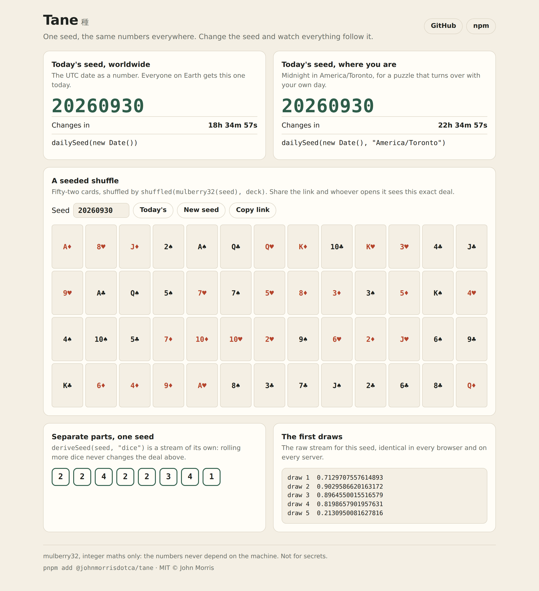

<h1 align="center">Tane <sub>種</sub></h1>

<p align="center"><strong>One seed, the same numbers everywhere.</strong><br>
Seeded random numbers and daily seeds for games, puzzles and tests: shuffle, pick and draw from a stream a seed fixes, in every browser and on every server, forever.</p>

<p align="center">
  <a href="https://github.com/johnmorrisdotca/tane/actions/workflows/ci.yml"></a>
  <a href="https://www.npmjs.com/package/@johnmorrisdotca/tane"></a>
  <a href="./LICENSE"></a>
  
  
</p>

<p align="center"><a href="https://johnmorrisdotca.github.io/tane/"><strong>Try today's seed →</strong></a></p>

<p align="center">
  
</p>

*Tane* is Japanese for a seed, the kind you plant. It is the random-number
core of [Itsutsu](https://itsutsu.com), a site of board games and daily
puzzles, where every deal, every daily puzzle and every computer player's coin
flip comes from it, exactly as published here.

```ts
import { mulberry32, shuffled, dailySeed } from "@johnmorrisdotca/tane";

const random = mulberry32(dailySeed(new Date()));   // today's stream: 20260930
shuffled(random, ["♠", "♥", "♦", "♣"]);             // the same order for everybody today
```

## Why

`Math.random` cannot be seeded, so anything built from it exists only in the
tab that made it. A daily puzzle, a shareable deal, a replay, a race between
two people on one board, a test that asserts exact values: each needs the same
numbers from the same seed on every machine. Tane is the small, careful piece
that gives you that, plus the everyday draws you would otherwise write (and
get subtly wrong) yourself.

## Features

- **Bit-for-bit reproducible.** mulberry32 over 32-bit integer maths, so the
  same seed gives the same numbers in every engine. Golden values are pinned
  in the tests and never move between versions.
- **A drop-in for `Math.random`.** A stream is `() => number` in [0, 1), so any
  code that takes `Math.random` takes a seeded stream unchanged.
- **The draws you need.** Integers, floats, coin flips, pick, shuffle (in place
  or a copy), sampling without replacement, weighted choice and a normal
  distribution, each documented with exactly how many numbers it takes.
- **Sub-streams.** `deriveSeed(seed, "deck")` and `deriveSeed(seed, "dice")`
  are unrelated streams from one seed, so adding a third part later never
  shifts the first two. `fork` splits a stream off another.
- **Stored state.** `step(state)` is the generator as a pure function, so a
  stream can live in a database row as one integer and pick up exactly where
  it stopped.
- **Seeds that travel.** Seeds are whole numbers from 1 to 2³¹ − 1, safe in an
  address or JSON. Keep ranges aside as *seed blocks* (the daily puzzles, a
  weekly event) and draw fresh seeds that never land in one.
- **One seed a day.** `dailySeed(date)` is the date as a number: 2026-09-30 is
  20260930. UTC by default, or the midnight of any IANA time zone, with
  calendar arithmetic that daylight saving cannot fool.
- **Tiny and typed.** No dependencies, ES modules, full TypeScript types,
  tree-shakeable, about three hundred lines. Two optional React hooks.

## Install

```sh
pnpm add @johnmorrisdotca/tane
```

ES modules with TypeScript types, for browsers and Node 20 or later. The React
hooks need React 18 or later; the rest needs nothing.

## Quick start

### A daily puzzle everyone shares

```ts
import { dailySeed, mulberry32, int } from "@johnmorrisdotca/tane";

const random = mulberry32(dailySeed(new Date()));
const target = int(random, 1, 100);   // today's number, the same for every player
```

### A shareable deal

```ts
import { freshSeed, isSeed, mulberry32, shuffled } from "@johnmorrisdotca/tane";

const fromLink = Number(new URL(location.href).searchParams.get("seed"));
const seed = isSeed(fromLink) ? fromLink : freshSeed();
const deck = shuffled(mulberry32(seed), cards);
history.replaceState(null, "", `?seed=${seed}`);    // the link now replays this deal
```

### Parts that never disturb each other

```ts
import { deriveSeed, mulberry32, shuffled, int } from "@johnmorrisdotca/tane";

const deck = shuffled(mulberry32(deriveSeed(gameSeed, "deck")), cards);
const dice = mulberry32(deriveSeed(gameSeed, "dice"));
int(dice, 1, 6);
```

### In React

```tsx
import { useDailySeed, useSeeded } from "@johnmorrisdotca/tane/react";
import { shuffled } from "@johnmorrisdotca/tane";

export function DailyDeal({ cards }: { cards: string[] }) {
  const { day, seed } = useDailySeed();            // moves to tomorrow at midnight on its own
  const deal = useSeeded(seed, (random) => shuffled(random, cards));
  return <Hand title={day} cards={deal} />;
}
```

## API

Every function is pure except where a stream is drawn from, and every type is
exported. Functions that draw take the stream first, so they work on
`Math.random` too.

### Streams

```ts
type Random = () => number;                          // in [0, 1), like Math.random
type Step = { readonly value: number; readonly state: number };

mulberry32(seed: number): Random                     // also exported as seededRandom
step(state: number): Step                            // one draw as a pure function
hashSeed(text: string): number                       // any text → an unsigned 32-bit seed
deriveSeed(seed: number, ...labels: (string | number)[]): number
fork(random: Random): Random                         // takes one draw from `random`
```

`step` walks the same stream as `mulberry32`: start from the seed, keep the
returned `state`, and the values match draw for draw.

```ts
let state = 42;
const first = step(state);   // first.value === mulberry32(42)()
state = first.state;         // store it; resume later
```

### Draws

| Function | Returns | Draws |
| --- | --- | --- |
| `below(random, n)` | an integer in [0, n) | 1 |
| `int(random, min, max)` | an integer from `min` to `max`, both included | 1 |
| `float(random, min, max)` | a number in [min, max) | 1 |
| `chance(random, p)` | `true` with probability `p` | 1 |
| `pick(random, items)` | one item | 1 |
| `shuffle(random, array)` | the same array, shuffled in place (Fisher–Yates) | length − 1 |
| `shuffled(random, items)` | a shuffled copy | length − 1 |
| `sample(random, items, count)` | `count` distinct items, in the order drawn | `count` |
| `distinctBelow(random, count, limit)` | `count` distinct integers below `limit`, redrawing repeats | varies |
| `weightedIndex(random, weights)` | an index chosen in proportion to its weight | 1 |
| `weightedPick(random, items, weights)` | the item at that index | 1 |
| `normal(random, mean = 0, spread = 1)` | a normally distributed number (Box–Muller) | 2 |

`below`, `int`, `pick` and `weightedPick` throw a `RangeError` for a range or
list with nothing in it, rather than returning `NaN` or `undefined`.

### Seeds

```ts
const SEED_MOST = 2 ** 31 - 1;
type SeedBlock = { readonly from: number; readonly size: number };   // from ≤ seed < from + size
type DrawSeedOptions = { readonly most?: number; readonly reserved?: readonly SeedBlock[] };

isSeed(value: unknown, most?: number): value is number   // a whole number from 1 to most
inBlock(seed: number, block: SeedBlock): boolean
checkBlocks(blocks: readonly SeedBlock[], most?: number): SeedBlock[]   // sorted; throws on overlap
drawSeed(random: Random, options?: DrawSeedOptions): number
freshSeed(options?: DrawSeedOptions): number             // drawSeed from Math.random
```

`drawSeed` spreads one draw over the seeds that are left and steps it over each
reserved block, so every free seed is equally likely and no draw is wasted.

```ts
const DAILY = { from: 1_000_000_000, size: 100_000_000 };
freshSeed({ reserved: [DAILY] });   // never a seed a day is played at
```

### Days

```ts
type DayKey = string;   // "YYYY-MM-DD"

dayKey(at: Date, timeZone = "UTC"): DayKey
dailySeed(at: Date, timeZone = "UTC"): number            // 2026-09-30 → 20260930
isDayKey(text: string): boolean                          // "2026-02-30" is not
addDays(day: DayKey, by: number): DayKey
daysBetween(from: DayKey, to: DayKey): number
nextDayStart(at: Date, timeZone = "UTC"): Date           // when the daily seed next changes
daySeed(day: DayKey, block: SeedBlock): number           // block.from + 20260930
dayOfSeed(seed: number, block: SeedBlock): DayKey | null // the inverse, or null
```

```ts
dailySeed(new Date("2026-10-01T03:30:00Z"));                     // 20261001
dailySeed(new Date("2026-10-01T03:30:00Z"), "America/Toronto");  // 20260930
```

### React (`@johnmorrisdotca/tane/react`)

```ts
useDailySeed(timeZone = "UTC"): { day: DayKey; seed: number }
useSeeded<T>(seed: number, make: (random: Random) => T): T
```

`useDailySeed` re-renders once, at the next midnight in the zone. `useSeeded`
runs `make` on a fresh stream whenever the seed changes, so the result depends
on the seed alone, never on how often the component rendered.

## Not for secrets

mulberry32 is a fast statistical generator, not a cryptographic one: its whole
state is 32 bits and can be recovered from a few outputs. Use
`crypto.getRandomValues` for passwords, tokens, invite codes, or a game where a
player could profit from predicting the next card.

## Browser and runtime support

Every evergreen browser, Node 20 and later, Deno and Bun. Time zones other than
UTC use `Intl.DateTimeFormat`, which every one of those supports.

## Roadmap

- Streams with more state (sfc32, xoshiro128**) behind the same `Random` type,
  for simulations that draw billions of numbers.
- `pickWeighted` from a table built once, for heavy weighted sampling (alias
  method).
- Weekly and monthly seeds beside the daily one.
- A command-line `tane` to print today's seed, or shuffle lines from a seed.

Ideas and requests are welcome in the issues.

## Contributing

See [CONTRIBUTING.md](./CONTRIBUTING.md). The one rule that matters most: a
seed's numbers never change, so every change is checked against the golden
values in the tests.

## Licence

[MIT](./LICENSE) © John Morris. mulberry32 is by Tommy Ettinger and in the
public domain.
